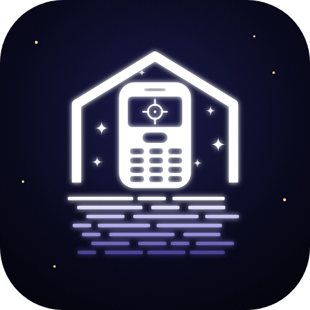
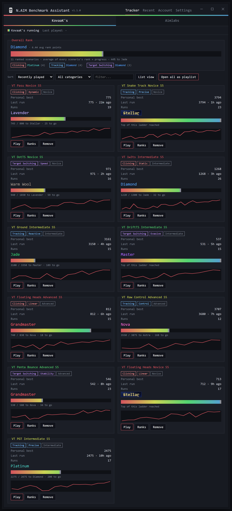
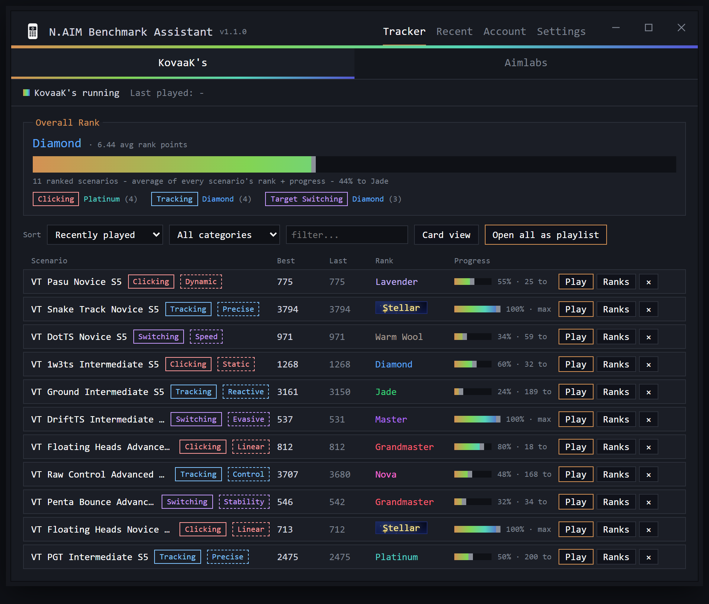
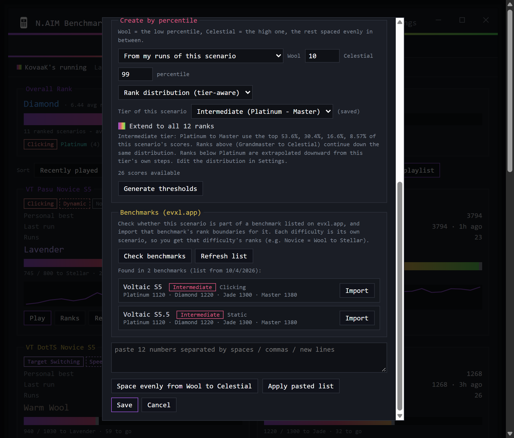
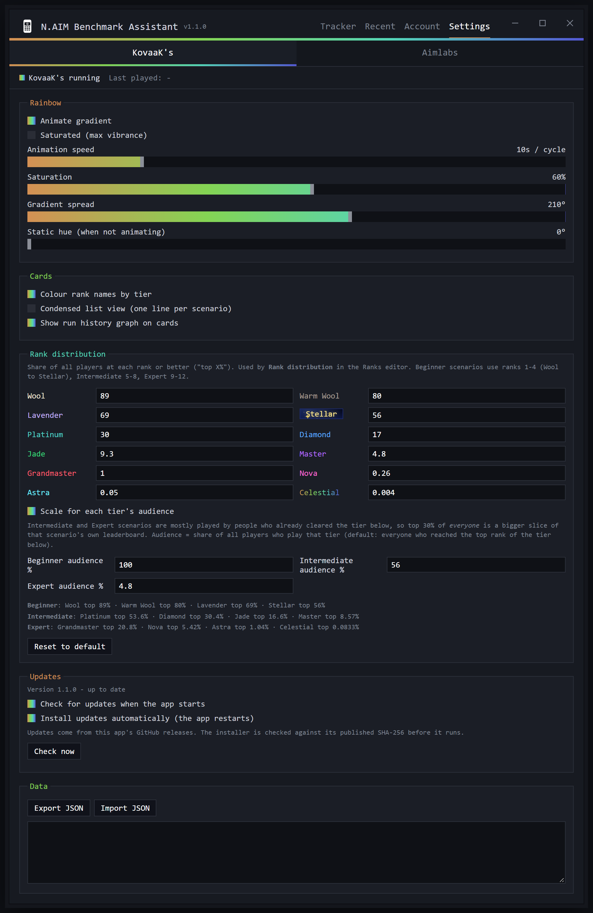

<p align="center"></p>

<h1 align="center">N.AIM Benchmark Assistant</h1>

<p align="center">A small, fast desktop tracker for your <b>KovaaK's</b> and <b>Aimlabs</b> scenarios.<br>
It notices the scenario you just played, asks if you want to track it, and shows your progress toward a rank.<br>
Ranks can be filled in from real leaderboard percentiles or from benchmarks listed on evxl.app.</p>

The app is about **110 KB** plus ~1 MB of libraries, and the installer is **about 500 KB**. It is not Electron: it is a tiny C# window around the Edge WebView2 engine that already ships with Windows 11, with its own title bar and window buttons.



> Screenshots use made-up demo scores on Voltaic Season 5 scenarios.

## Features

**Tracking**
- Detects what you play: KovaaK's from its stats files, Aimlabs from its local database (read-only). Finish a run on a scenario you don't track and it asks: **Add to tracker / Not now / Never ask for this one**. Adding a scenario imports your past runs of it.
- A tab for each game, each with its own tracked list, Recent tab, overall rank and prompts.
- Personal best, last run, run count, rank, a progress bar to the next rank, and a history graph per scenario.
- **Overall Rank** panel: the average of every scenario's rank plus progress, with a per-category summary.
- Optional **condensed list view** (one line per scenario) and a category filter and sort.



**Ranks**
- Twelve ranks with their own names and looks: **Wool, Warm Wool, Lavender, Stellar** (an animated night-sky badge), Platinum, Diamond, Jade, Master, Grandmaster, Nova, Astra, Celestial.
- Set a rank threshold per scenario by hand, by pasting a list, or let the app work them out (below). A scenario can have a **partial ladder** (for example just Wool to Stellar), as benchmarks do.
- **Rank distribution (tier-aware):** the "top X% of all players" for each rank is editable in Settings (it starts with a Voltaic-style distribution). Pick a tier for the scenario, Beginner, Intermediate or Expert, and the cutoffs are scaled to that tier's audience, because Intermediate and Expert scenarios are played by people who already cleared the tier below. Scores come from the **KovaaK's leaderboard**, from **your own runs**, or from **pasted scores**. It can extend the ladder to all 12 ranks: ranks above the tier continue down the same distribution, ranks below are extrapolated.
- **Benchmarks (evxl.app):** check whether a scenario is part of a benchmark listed on evxl.app and import that benchmark's rank boundaries for it. Each difficulty is its own scenario, so you get that difficulty's ranks.



**Categories**
- Clicking / Tracking / Target Switching chips, and subcategories (Dynamic, Static, Linear, Precise, Reactive, Control, Speed, Evasive, Stability) for the 54 Voltaic Season 5 benchmark scenarios. Other KovaaK's scenarios use KovaaK's own scenario type. You can always set a category by hand.

**In the game**
- Click a scenario's name (or **Play**) to open it in KovaaK's in Challenge mode.
- **Open all as playlist** writes a local KovaaK's playlist from what's on screen.
- Aimlabs has no link that opens a workshop task, so Play starts the game and copies the scenario name.

**Look**
- Its own title bar and minimise / maximise / close buttons in the app's style (drag the header to move, drag the edges to resize).
- Animated rainbow gradient, with speed, saturation, spread and a **Saturated** switch. Rank colours and graphs can be turned off.



**Accounts**
- Detects your Steam account (name, account, SteamID64) and your KovaaK's and Aimlabs data. KovaaK's and Aimlabs both sign in through Steam, so there is no separate login to read.

## Install

1. Download **`NAIM-Benchmark-Assistant-Setup.exe`** from the [latest release](../../releases/latest) and run it. It installs for your user only (no admin rights) and adds Desktop and Start Menu shortcuts.
2. Windows may warn about an unknown publisher, because the installer isn't code-signed. Click **More info**, then **Run anyway**.

Needs Windows 10/11 (64-bit). Windows 11 already includes the WebView2 runtime; on Windows 10 install the *Evergreen WebView2 Runtime* from Microsoft.

### Updates

The app checks this repository's latest release when it starts. If there is a newer one it downloads `NAIM-Benchmark-Assistant-Setup.exe`, **verifies its SHA-256** against the published checksum, runs it and restarts. You can turn automatic install off (you'll get an "Update" button instead) or turn checking off entirely in **Settings -> Updates**. The app only ever downloads from this repository's releases.

**Beta builds** (for example `1.1.1-beta`) are published as GitHub *pre-releases*. They are not offered by the automatic update, so stable installs are never moved to a beta by surprise; download the setup from the [releases page](../../releases) to try one.

## Build from source

No Visual Studio or SDK needed, only Windows and PowerShell:

```powershell
powershell -ExecutionPolicy Bypass -File build.ps1              # dist\NAIM-Benchmark-Assistant\NAIM-Benchmark-Assistant.exe
powershell -ExecutionPolicy Bypass -File build.ps1 -Installer   # also dist\NAIM-Benchmark-Assistant-Setup.exe and its .sha256
```

It uses the C# compiler built into Windows plus the small WebView2 wrapper libraries downloaded from NuGet. The whole UI is one file, `src/index.html`; `src/Program.cs` is the native side (window, reading game files, network, updates). The logo is generated by `assets/make_logo.py`.

### Releasing (for the maintainer)

Bump `Meta.Version` in `src/Program.cs`, run `build.ps1 -Installer`, then publish a GitHub release tagged `vX.Y.Z` with both `NAIM-Benchmark-Assistant-Setup.exe` and `NAIM-Benchmark-Assistant-Setup.exe.sha256` attached.

## Where your data lives

- `%LOCALAPPDATA%\N.AIM Benchmark Assistant\tracker.json` - your tracked scenarios, ranks and settings.
- `%LOCALAPPDATA%\N.AIM Benchmark Assistant\bench-index.json` - a cache of the benchmark list.
- The app only **reads** the games' files (KovaaK's `stats` CSVs, Aimlabs' local database and replay files). It never writes to them, except the optional playlist file you ask for.
- Earlier versions (named *Aim Tracker*) kept their files in `%LOCALAPPDATA%\SensSwitcher`; they are copied over automatically the first time the new version starts.

## What it talks to on the internet

Only when you use the feature that needs it:

| Feature | Request |
|---|---|
| Updates | `api.github.com` (this repo's latest release) |
| KovaaK's leaderboard percentiles, scenario types | `kovaaks.com` public web API (scenario name, leaderboard ranks) |
| Benchmarks | `evxl.app` (its benchmark list) and `kovaaks.com` (boundaries; your SteamID is sent because that endpoint asks for one) |

Nothing is uploaded anywhere else and there is no telemetry.

## Notes and limits

- It uses public, **unofficial** web APIs and reads the sites' own published data, so features can break if those change.
- Aimlabs scenario names are stored shortened in its database; full names are recovered from other files it keeps, and older scenarios that no longer exist locally show a shortened name until you play them again.
- Percentiles from **your own runs** only describe you; use the leaderboard source for a population.
- The extrapolated ranks below a tier are estimates, not measured data.

## Credits

- Voltaic Season 5 scenario categories: the community benchmark list used by [Dylan-B-D/vt-s5-benchmark-tracker](https://github.com/Dylan-B-D/vt-s5-benchmark-tracker).
- Benchmark list: [evxl.app](https://evxl.app). Scores and boundaries: KovaaK's.
- Not affiliated with KovaaK's, Aimlabs, Voltaic, evxl.app or Valve.

## License

[MIT](LICENSE)
